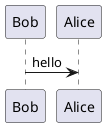

# Markdown Snippets

## Tabs

<tabs>
<tab title="Home">
This is the home tab

</tab>
<tab title="About">
This is the about tab

</tab>
</tabs>

```markdown
<tabs>
<tab title="Home">
This is the home tab

</tab>
<tab title="About">
This is the about tab

</tab>
</tabs>
```

## Code

```python
print("Hello World")
```

```c++
#include <iostream>
using namespace std;

int main() {
    cout << "Hello World" << endl;
    return 0;
}
```

{ collapsible="true" default-state="collapsed"}

## Tables

### Header row

| Header 1 | Header 2 | Header 3 |
|----------|----------|----------|
| Cell 1   | Cell 2   | Cell 3   |

{style="header-row"}

```
| Header 1 | Header 2 | Header 3 |
|----------|----------|----------|
| Cell 1   | Cell 2   | Cell 3   |
{style="header-row"} or just nothing
```


### Header column

| Header 1 | Header 2 | Header 3 |
|----------|----------|----------|
| Cell 1   | Cell 2   | Cell 3   |

{style="header-column"}

```
| Header 1 | Header 2 | Header 3 |
|----------|----------|----------|
| Cell 1   | Cell 2   | Cell 3   |
{style="header-column"}
```

### Header row and column

| Header 1 | Header 2 | Header 3 |
|----------|----------|----------|
| Cell 1   | Cell 2   | Cell 3   |

{style="both"}

```
| Header 1 | Header 2 | Header 3 |
|----------|----------|----------|
| Cell 1   | Cell 2   | Cell 3   |
{style="both"}
```

### none

| Header 1 | Header 2 | Header 3 |
|----------|----------|----------|
| Cell 1   | Cell 2   | Cell 3   |

{style="none"}

```
| Header 1 | Header 2 | Header 3 |
|----------|----------|----------|
| Cell 1   | Cell 2   | Cell 3   |
{style="none"}
```


## Tooltip

This is a <tooltip text="tooltip">tooltip</tooltip> example.

```markdown
This is a <tooltip text="tooltip">tooltip</tooltip> example.
```


Add the tooltip in the  /Writeside/cfg/glossary.xml file like this:

```xml
    <term name="tooltip">Tooltips show a definition when a user hovers over a term.</term>
```

## Tldr

<tldr>
    <p>Shortcut: <shortcut>Ctrl+Space</shortcut></p>
    <p>Configure: <ui-path>Settings / Preferences | Editor | Code Completion</ui-path></p>
</tldr>


```xml
<tldr>
    <p>Shortcut: <shortcut>Ctrl+Space</shortcut></p>
    <p>Configure: <ui-path>Settings / Preferences | Editor | Code Completion</ui-path></p>
</tldr>
```

## Tip

> This is a tip

```markdown

> This is a tip
```

## Warning

> This is a warning
{style="warning"}

```markdown
> This is a warning
{style="warning"}
```

## Note

> This is a note
{style="note"}

```markdown
> This is a note
{style="note"}
```

## Math

```tex
\begin{equation}
x = \frac{-b \pm \sqrt{b^2 - 4ac}}{2a}
\end{equation}
```

## Mermaid


## PlantUML Diagrams




